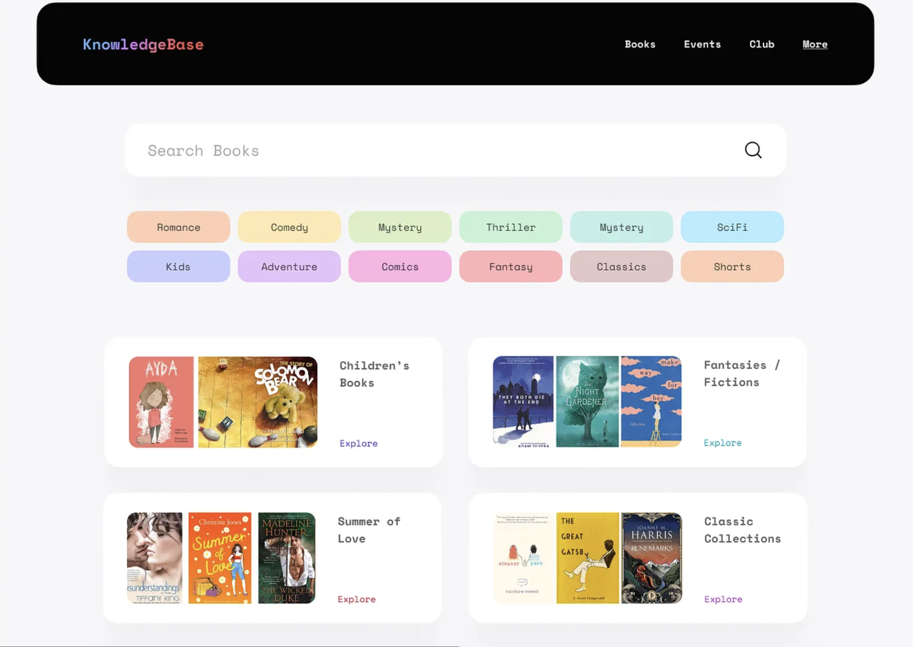

# BookShelf API Project

## Overview

In this project, you'll build a complete REST API for managing a personal bookshelf using Express.js. Instead of connecting to a database (for now), you'll use the **_LOCAL FILE SYSTEM_** to store your data in a JSON file. You will also be connecting this API with a `frontend`.

## Learning Objectives

- Implement a RESTful API using Express.js
- Use the file system as a simple database
- Organize code using the `MVC` pattern
- Handle asynchronous file operations

## Requirements

### Technical Requirements

- Add `"type": "module"` to your package.json to enable ES Modules

### API Requirements

Your API should support the following endpoints:

#### Books

- `GET /api/books` - Get all books
- `GET /api/books/:id` - Get a specific book by ID
- `POST /api/books` - Add a new book
- `PUT /api/books/:id` - Update a book
- `DELETE /api/books/:id` - Delete a book

#### Collections

- `GET /api/collections` - Get all collections
- `GET /api/collections/:id` - Get a specific collection
- `POST /api/collections` - Create a new collection
- `PUT /api/collections/:id` - Update a collection
- `DELETE /api/collections/:id` - Delete a collection
- `GET /api/collections/:id/books` - Get all books in a collection

## Project Structure

Organize your project using the Model-Controller pattern:

```
bookshelf-api/
├── controllers/
│   ├── bookController.js
│   └── collectionController.js
├── models/
│   ├── bookModel.js
│   └── collectionModel.js
├── data/
│   └── database.json
├── routes/
│   ├── bookRoutes.js
│   └── collectionRoutes.js
├── utils/
│   └── fileUtils.js
├── app.js
├── server.js
└── package.json
```

## Data Schema - "Database"

There is a `database.json` file located at `data/database.json` and it contains
two main arrays:

1. `books` - Array of book objects
2. `collections` - Array of collection objects that can contain books

> [!IMPORTANT]
> Notice that there is a **_RELATIONSHIP_** in our data!

Example schema:

```json
{
  "books": [
    {
      "id": "1",
      "title": "To Kill a Mockingbird",
      "author": "Harper Lee",
      "year": 1960,
      "genre": "Fiction",
      "rating": 4.5,
      "isRead": true
    }
  ],
  "collections": [
    {
      "id": "1",
      "name": "Classics",
      "description": "Classic literature books",
      "bookIds": ["1"]
    }
  ]
}
```

## Implementation Guidelines

### Package.json Setup for ES Modules

```json
{
  "name": "bookshelf-api",
  "version": "1.0.0",
  "description": "A file-based book collection API",
  "main": "server.js",
  "type": "module",
  "scripts": {
    "start": "node server.js",
    "dev": "nodemon server.js"
  },
  "dependencies": {
    "express": "^4.18.2",
    "cors": "^2.8.5"
  },
  "devDependencies": {
    "nodemon": "^2.0.22"
  }
}
```

### Models

The model layer should handle all data access logic using simple JavaScript objects. Since we're using a file as our database, your models should:

- Read from the JSON file
- Write to the JSON file
- Implement functions for CRUD operations

Example for a model:

```javascript
// models/bookModel.js
import { readDatabase, writeDatabase } from "../utils/fileUtils.js";

// this is a simple object with some functions!
const bookModel = {
  getAllBooks: async function () {
    const data = await readDatabase();
    return data.books;
  },

  getBookById: async function (id) {
    const data = await readDatabase();
    return data.books.find((book) => book.id === id);
  },

  // you can add the rest of the functions here for the model.
};

export default bookModel;
```

### Controllers

Controllers should handle the request/response cycle and use the models to access data:

```javascript
// controllers/bookController.js
import bookModel from "../models/bookModel.js";

const bookController = {
  getAllBooks: async function (req, res) {
    try {
      const books = await bookModel.getAllBooks();
      res.json(books);
    } catch (error) {
      res.status(500).json({ error: error.message });
    }
  },

  // here you add the rest of bookController methods ...
};

export default bookController;
```

### Routes

Create route files to define API endpoints and connect them to controller functions:

```javascript
// routes/bookRoutes.js
import express from "express";
import bookController from "../controllers/bookController.js";

const router = express.Router();

// define some routes for book controller
router.get("/", bookController.getAllBooks);

// implement the rest of the routes...

export default router;
```

### App and Server Setup

```javascript
// app.js
import express from "express";
import cors from "cors";
import bookRoutes from "./routes/bookRoutes.js";
import collectionRoutes from "./routes/collectionRoutes.js";

const app = express();

// middlewares!
app.use(express.json());

app.use(cors());

// our routes!
app.use("/api/books", bookRoutes);
app.use("/api/collections", collectionRoutes);

app.get("/", (req, res) => {
  res.send(
    "Welcome to the bookshelf api! Use /api/books or /api/collections to access resources",
  );
});

// if our server detects an error, we can handle it!
app.use((err, req, res, next) => {
  console.error(err.stack);
  res.status(500).json({ error: "Something went wrong!" });
});

export default app;
```

```javascript
// server.js
// which is our point of entry
import app from "./app.js";

const PORT = process.env.PORT || 3000;

app.listen(PORT, () => {
  console.log(`Server running on port ${PORT}`);
});
```

### File Utilities

Create utility functions to handle file operations.

### Test your API as you go

Make sure to use something like [Postman](https://www.postman.com/downloads/)
to test your `API`. Incrementally test it as each endpoint is in "ready" state.

### Finally, your frontend

Now, it is time to hook everything app to an UI. Create a `React` frontend for your `API` and
ensure your application is responsive. Some inspiration for a bookshelf UI:




## Bonus Challenges

Once you've completed the main requirements, try these bonus challenges:

1. Implement search functionality for books
2. Implement **middleware** for logging all API requests
